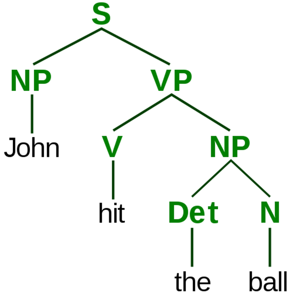
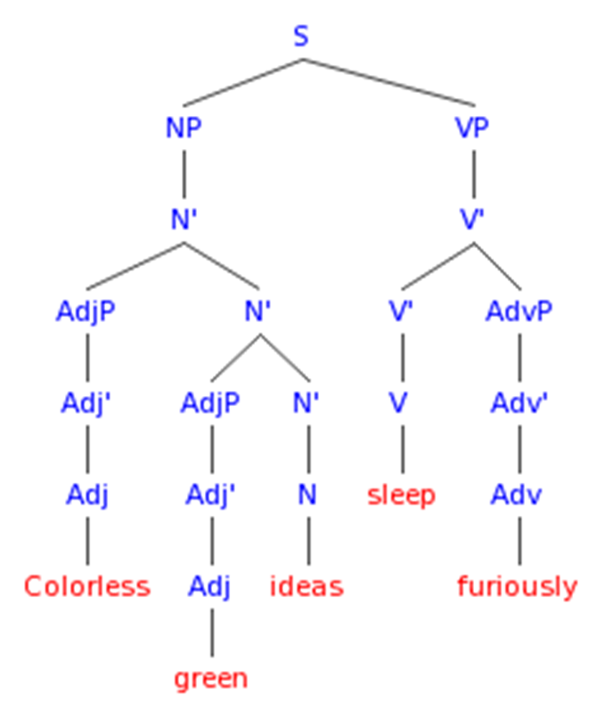

如前所述，Chomsky 考察了人类幼崽语言获得*的情况，发现行为主义框架是成问题的。在行为主义看来，语言学习无非就是操作性条件反射，其刺激是当一个球出现且伴随家长的声音「qiu」，而其反应是幼崽回复道「qiu」。当家长提供正向强化时，幼崽便会增加反应的频率\*\*。正如行为主义的历史处境，心理语言学的行为主义理论在过去曾是主流，但仍然避免不了概念和实验证据的双重挑战。Chomsky 的理论\***是其中最重要的革命力量。

---
\* 根据汉字世界二语研究的传统，称第一语言为获得，第二语言为习得。我们尊重这个区分，即便英语均对应 acquisition 一词。另，本文仅考察一语获得，但也包括多语者可能同时有多个一语获得。

** Skinner, B.F. Verbal Behabior (1957).

*** Chomsky. A Review of B.F. Skinner's Verbal Behabior, Language I (1959).

  

对 Chomsky 来说，发育当中的幼崽的语言产出远远超过受到的语言训练，个中差距必定是心灵运作的结果。具体而言，Chomsky 的框架是，
- 人必须拥有一个获得并处理语言的感官，他称为 Language Acquisition Device (LAD).
- 生成-转换语法 (Generative/Transformation Grammar)描述了 LAD 的语法学，将公共语言作为输入，并根据程序规则来算出语法形式作为输出
- 语法转换规则是人类先天共有的，即万有语法 (Univerisal Grammar)

这是 Chomsky 最原始版本的观点。在世纪之交他对语言感官进一步做了如下区分：
- 狭义语言感官 (faculty of language in the narrow sense, FLN) 使用形式的递归过程来处理语言。仅靠递归就可解释前述人类幼崽生成复杂语法的现象，这也被称为 Chomsky 的极小主义纲领。
- 广义语言感官 (faculty of language in the broad sense, FLB) 包含 FLN 语法学机器以外的全部特征。

  

我们展开解释这个框架。第一，Chomsky 注意到在语言的日常使用中语法*和语义**确实是相分离的，证成了 FLN/LAD 可以单独考虑语法的合理性。分离的证据诸如，
- 语言处理的速度和难度。Chomsky ***考察了以下两个句子
  > Colorless green ideas sleep furiously.

  > Furiously sleep ideas green colorless.

	这两句话在语义上都是成问题的，但是第一句话由于合乎语法，能够更快地被读者所接受（可以通过一个反应时间的实验来证实）。

- 行为与神经科学。感觉性失语症患者无法说出有意义的句子，但却能保持语法正确****。例子见[这个 Youtube 视频](https://www.youtube.com/watch?v=aVhYN7NTIKU)和[这个](https://www.youtube.com/watch?v=3oef68YabD0&t=9s)。\*\*\*\*\*

第二，FLN/LAD 将公共语言的表层结构分析成深层结构，也叫短语结构(phrase structure)。如句子 "John hit the ball"，其句法树形如

其中 S 表示句子，NP = Noun Phrase 表示名词短语，VP = Verbal Phrase 表示动词短语，Det = Determiner 表示限定词，N = Noun 表示名词。另一个例子的语法分析是

第三，Chomsky 认为转换规则是程序化的，并且包含在 FLN 中。比如主动句到被动句的变换，其转换规则即为

> NP1 + V + NP2
> 
> =>
> 
> NP2 + Aux + V + PP + NP1
> 
> (Eg. John hit the ball => the ball has been hit by John)

---
\* 符号按规则的恰当形成

** 符号的解释

*** Chomsky. Syntactic Structures (1957).

**** Dronkers, et al. Lesion analysis of the brain areas involved in language comprehension. Cognition 92 (2004).

***** 题外话：Godel 等人的逻辑研究表明数学的语法和语义也是相分离的。关于数学和语言的相似性，之后的文章可能会提及。

  

并不是所有的公共语言的结构都类似于英语，比如中文允许句子不以名词开头（It's me. = 是我。）。Chomsky 对此的修正是参数设置 (Parameter-Setting) 理论*，其大意是 LAD/FLN 具有一个开关盒，对英语来说主语开关是打开的，但对中文来说开关打到的是可选。具体如何设置由幼崽输入经验而定。更进一步，开关间是有联系的<!-- 比如在英语中 "Who do you think that left" 不合语法，是因为 left 需要的主语。 -->。Chomsky 假设道这些参数设置是有序的并且幼崽默认某一套设置，当证据迫使改变时才使用另一套。为什么可以假设参数设置是有序的？一个理由是幼崽们本身就不会系统地接触负面证据（即不合语法的句子），所以当使用参数设置A生成同样包含在参数设置B的句子时会先假设A，只当遇到需要生成不在A里的句子的情况时才会假设B。这被称为「子集原理」。

一些语言的句子中，词的顺序是不敏感的，最极端的甚至可以随意放置，比如澳大利亚土著语 Warlpiri。那么在「子集原理」下，幼崽究竟是默认的是词有顺序还是没有？如果默认没有的话，学话期幼崽在开口说话时应该会造出乱序的不合语法句子，但在英语幼崽中并没有结论性的这种观察。另一边，在语序不敏感的语言里，却可以观察到幼崽对特定语序的保守倾向**。如此似乎显示了在子集原理为真的情况下，幼崽最先默认的参数设置是句子有严格语序。

Wexler 和 Manzini 还研究了先行词 (antecedent, 如代词 she) 和回指 (anaphora, 如反身代词 herself) 的使用区别。在不同语言中，回指的管辖范围不一样，且指代落在管辖范围中的先行词。比如 John likes himself 合乎语法而 John thinks that Mary likes himself 不合。子集原理预测幼崽应该开始于假定最小的管辖范围，然后当他们遇到更多的句子后假定会逐步扩大。有意思的是，与回指不同，代词似乎倾向于假定最大的管辖范围。比如 John thinks that Mary likes him 合乎语法而 John likes him 不合。管辖范围扩大后语法可能性就会减少，因为代词避免了对应先行词重复出现。他们的实验研究对以上预测提供了支持。

---
\* Ayoun, D. Parameter Setting in Language Acquisition (2005).

** Pinker. Language Acquisition, Sec 6.9.3.

  

回到 Chomsky 的语言获得理论。其与竞争理论即行为主义学习理论中谁更得到实验证据支持？Gleason* 让 4-7 岁的幼崽看类似于鸟的东西的照片，并告诉他们这个是一个 wug，一个生造的单词。然后让他们填空
> There are two ___.

99% 的幼崽回答了 wugs。这个结果高度提示了行为主义的失败，因为幼崽们从来没有暴露过 wug/wugs 的刺激，却回答了近乎一致的答案，也就是说行为学习以外仍在某种心灵机制下进行了语言学习，这种心灵机制并非简单的行为连结，而是记忆系统，关于相似语法结构的认知规则，和语法的内知识。用内在心灵状态来解释超过行为连结的外在行为的假说就是认知主义。

第二个实验证据来自幼崽对语法复杂度的敏感。Crain 和中山峰治**让 3-5 岁的幼崽对一个娃娃提问是否 "the boy who is unhappy is watching mickey mouse"。转述的关键在于提前哪个 is，两种可能性
- 简单规则 (Simple Rule, SR)： 把第一个动词提前
- 结构敏感规则 (Structure-Sensitive Rule, SSR)：把名词短语后的第一个动词提前

实验结果是所有幼崽都是 SSR，高度提示了幼崽使用了结构敏感规则的心理表征进行了转换。由于实验涉及的句子几乎不可能被幼崽们言说过，这说明行为主义立场再一次失效。

---
\* Pinker. Words and Rules (1999).

** Crain, Nakayama. Structure Dependence in Children's Language. Language 62 (1986).

  

Chomsky 的理论属于物理符号系统假设 (physical symbol system hypothesis) 的一种。语言其治于规则的特性使得这是一个很好的用来谈论信息处理的不同模型的起点，信息处理即在根据系统中显式表征的规则来操控物理符号结构。认知主义理论家认为理解语言就是掌握语言的规则。一个极端是 Wittgenstein 认为语言规则无外乎就是把正确的语句区分于不正确的语句，不关乎规则的任何表征，从而将语言理解视为完全的实践问题；另一个极端是认为语言规则就是得出并理解规则在心灵的内化表征，从而将语言理解视为完全的理论问题。

  

Chomsky 认为万有语法的获得是先天的。但下次，我们将借助神经科学证据对先天主义展开批判。