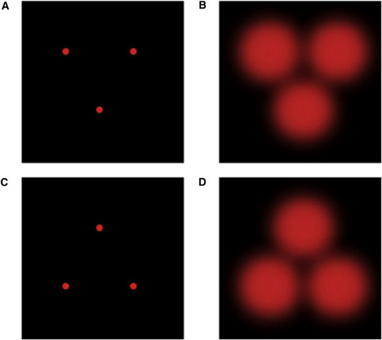

我们来仔细考察 Chomsky 理论认为的 LAD/LFN 万有语法是天生或者先天的论断。先天性一直是哲学的主题，理性主义*认为有一些概念不可能被感觉经验所学习，从而这些概念是先天的；经验主义\*\*则认为心灵一开始是一块白板，所有的概念都来自于感官经验。Chomsky 早期论述了他对语言持理性主义立场\*\*\*；可想而知，不支持 Chomsky 理论的人会更倾向于经验主义。

但是先天性这个概念所指为何？最粗浅的看法可以等同于并非学习到的，可是我们不想将因头脑损伤而获得的信念也包括为先天。精细一点的看法可以修正为由基因驱动的，这里需要提请注意的是由基因驱动的行为也同时依赖于环境因素。猴子虽然先天地害怕蛇，但只有在关键时期内观察到同类表现出恐惧反应才会表现出害怕\*\*\*\*。小鸭会在刚孵化的关键时期内跟遇到的第一个物体发生立即的、不可逆的强烈联系\*\*\*\*\*。跟针尾鸭一起饲养成长的雌性绿头鸭会在遇到第一只雄性绿头鸭时表现出绿头鸭的求偶行为\*\*\*\*\*\*。非洲爱情鸟将筑巢材料塞进羽毛中，费氏爱情鸟将用喙运送筑巢材料，它们的杂交后代会将材料先塞进羽毛中，再用喙运走\*\*\*\*\*\*\*。这些证据都表明先天性在动物界中无处不在。

一些晚近的作者倾向于重新审视理性主义和经验主义之间，或者先天主义与非先天主义之间的争论。他们注意到经验主义者实际上接受基因驱动的内生能力，比如联系推理、归纳、演绎，因为这些都是一般认知技能，他们不接受的只是特种领域的基因驱动知识，比如语法知识。

---

\* Rationalism. 如 Socrates (苏格拉底), Descartes (笛卡尔, "我思故我在"), Leibniz (莱布尼兹).

** Empiricism. 如 Locke (洛克), Berkeley (贝克莱, "存在就是被感知"), Hume (休谟).

*** Chomsky. Cartesian Linguistics (1966). 也见 Pinker. The Language Instinct (1994). 和 Pinker. The Blank Slate (2002).

**** Mineka, Davidson, Cook, Keir. Ovservational Conditions of Snake Fearing Rhesus Monkeys. J. Abnormal Psy 93 (1984).

***** https://www.youtube.com/watch?v=eqZmW7uIPW4

****** Lorenz. The nature of instincts. In: Schiller, ed. Instinctive Behavior (1957).

******* Dilger, W. The behavior of lovebirds. Scientific American 206 (I) (1962).

  

确实有初步证据显示语言有其先天性，虽然初步的意思是这些证据面临的挑战只多不少。
- 语言机能表现了基因、形态和发育特征。基因和神经生物学上，目前确定有关语言的是 FOXP2 基因，区别于其他物种的碱基对是 N303 和 S325。只有现代智人和尼安德特人拥有 N303。这两个基因影响语言相关的脑区，即 Broca 区和 Wernicke 区*,\*\*。语言能力类似于其他基因特征，其表达也具有关键时期（统计显示峰值在两岁半），并且在所有语言中都表现出一致的获得阶段***。
- 语言发育的相当早期已有高度的语法理解力。对还只会说单个词汇的一岁稍大幼崽进行测试，一个电视屏幕展现 "Cookie Monster tickling Big Bird" 的图像，另一个展现 "Big Bird tickling Cookie Monster"，实验人员会说其中某一句话来观察幼崽们看向哪个屏幕。实验结果是幼崽们看向正确的屏幕的时间显著更长，研究人员认为这是由于语法的某种先天表征存在于心灵，并且这种表征敏感于由谁作主语****。研究人员进一步分析，由于幼崽们只会说单个词，这些表征并不根据行为主义所要求的那样，通过强化某种话语行为来获得，所以行为主义式条件反应不存在。并且考虑幼崽的年龄，实验结果提示了幼崽心灵存在对复杂语法的某种先天的内生敏感性，研究人员于是反诘其理论对手即一般学习理论，要求解释这种敏感如何可能来自于一般认知能力。
- 语言发育的相当早期已有高度的语音感知力。让幼崽听录音，观察到比起成年人发音更偏好其他幼崽发音，比起他人发音（即便是母亲）更偏好自己的发音*****,******。
- 欠刺激论证。幼崽们暴露的语言环境对语言发展来说其实是不充分的。对训练输入和言语产出的统计学分析显示*******，对输出的需要来说，幼崽的语言输入只是即兴的。Chomsky 于是认为最好的解释是先天性。

---

\* Barwick, Chomsky. Why Only Us: Language and Evolution (2016). 

** Usui, et al. Decoding the Molecular Evolution of Human Cognition Using Comparative Genomics. Brain, Behavior, and Evolution 84 (2014): 103-116.

*** Stromswold. The cognitive neuroscience of language acquisition. In: Gazzaniga, ed. The New Cognitive Neurosciences (2000).

**** Hirsch-Pasek, Golinkoff. Language Comprehension: a New Look at some Old THemes. In: Kresneger et al, Ed. Biological and Behavioral Determinants of Language Development (1991).

***** Vouloumanos, Werker. Tuned to the signal: The privileged status of speech for young infants. Development Science 7 (2004).

****** Schulrz, Vouloumanos. Three-month-olds perfer speech to other naturally occurring signals. Language Learning and Development 6 (2010).

******* Pinker. Language Acquisition, Sec 6.6.2, 6.8.1.

  

但是一般学习理论也有自己的证据支持。

- Tomasello* 论证道幼崽可以通过演绎推理等一般原则来推断模式，从而获得语法知识。
- 英语过去时涉及动词的规则变化和不规则变化。幼崽在学习英语过去式时会经历如下三个阶段
  - 阶段一：使用一小部分过去式，记忆但不推广
  - 阶段二：使用更多的过去式，对不规则动词过度使用规则变形
  - 阶段三：规则动词和不规则动词的正确率一起提高

  经典的规则系统即可建模这些阶段：阶段一是训练数据集，对其归纳导致过度推广就是阶段二，重复训练与纠正成为阶段三。

Chomsky 理论的支持者，也即认为语言有处理一般智能以外的专门官能，则质疑：

- 中风导致 Broca 失语症的患者有良好的智力但却失去语言能力*\*，Williams 综合征(鸡尾酒综合征)的患儿在智力上有严重问题但是有流畅的语言能力***，高度提示语言智能独立于一般智能。
- 同样也有其他特种领域的先天性。幼崽对人脸识别的刺激更为敏感****，45月龄幼崽对母亲的脸比起陌生人的更有偏好\*\*\*\*\*，甚至在妊娠晚期的胎儿已经对子宫壁投影的类似脸的刺激反应强烈\*\*\*\*\*\*.\*\*\*\*\*\*\*

---

\* Tomasello. Constructing a Language: A Usage-Based Theory of Language Acquisition (2003).

** Keller, et al. Broca's Area. Brain and Language 109 (2009).

*** Mervis, Klein-Tasman. Williams Syndrome. Mental Retardation and Developmental Disabilities Research Review 6 (2000).

**** Johnson, Morton. Biology & Cognitive Development: The Case of Face Recoginition (1991).

***** Field, Woodson, Greenburg, Cohen. Discreimination and Imitation of Facial Exoression by Neonates. Science 21 (1982).

****** Reid, et al. The Human Fetus Preferentially Engages with Face-like Visual Stimuli. Current Biology 28(5) (2018), 824.

******* 神经科学已经知道视觉皮层中有专门的面孔小块处理人类面孔的刺激，但仍不清楚面孔小块的发育史，过去的假设是长期学习的结果。显然以上诸引文共同反对了这一假设。

  

先天主义也绝非语言能力的最终答案，这里概述 SEP: Language and Innateness, Sec 3 提供的一些反对。再次提请注意本段只是概述，一切证据都需仔细评估。概念上，万有语法的存在不一定是先天性的结果，也有可能是人类公共的交流需求或者认知限制塑造而成的。生物学上，神经系统本身是多功能的、具有可塑性和个体差异，语言能力的神经本体从而本身是一个高度可疑的概念；基因的作用是复杂的，与环境的交互也是复杂的，涉及多个基因则更加复杂，这都使语言能力的基因本体高度可疑。语言学上，从 Pidgin 语*产生的 Creoles 语**是一门完全发展的语言，具有高度复杂的语法结构，但它的发展受到的是文化和环境的影响而不依赖于内在的语言器官；而且所有语言都不是永恒不变的，而是在各种影响下在历史中不断演化，说演化的结果是先天性的话则非常可疑。

---

\* 即皮钦语，泛指用来在不同母语者之间交流的简化的语言，例子如洋泾滨、日语协和语

** 克里奥尔语，例子如台湾日语、新加坡汉语

  

总之，语言能力是否是先天的完全是一个实证问题。二十一世纪的科学必须带给我们这个答案，也终将带给我们这个答案。